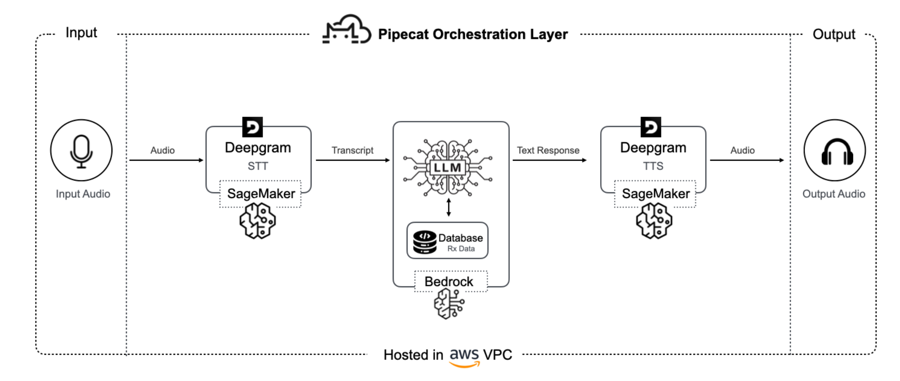

# Pipecat + Deepgram Voice Agent Demo

A production-ready voice AI agent demonstrating real-time conversational AI using **Deepgram** for speech processing on **AWS SageMaker**, **Amazon Bedrock** for LLM, and **Pipecat** for orchestration — all running securely within an **AWS VPC**.



## Demo Video

To show what this unlocks in a real workflow, this demo showcases a **pharmacy voice agent** built on Deepgram and running on SageMaker.

In the demo, the agent handles an **end-to-end customer inquiry**:
1. Authenticating a caller with a Member ID
2. Pulling the correct order
3. Identifying the medication
4. Checking refill availability
5. Giving a precise pickup time

Each step is powered by **real-time streaming STT, TTS, and agent logic running natively on SageMaker**, so the interaction feels natural and responsive while retrieving accurate, structured data from backend systems.

[](https://youtube.com/watch?v=VIDEO_ID)

---

## How the Demo Works


The diagram illustrates the workflow behind the pharmacy demo:

| Step | Component | Description |
|------|-----------|-------------|
| 1 | **Input Audio** | User speaks into microphone |
| 2 | **Deepgram STT** | Audio streams to Deepgram via SageMaker Bidirectional Streaming API |
| 3 | **LLM (Bedrock)** | Transcript passed to Amazon Bedrock with pharmacy data context |
| 4 | **Database** | LLM queries Rx database for orders, medications, refills |
| 5 | **Deepgram TTS** | Response synthesized via SageMaker Bidirectional Streaming API |
| 6 | **Output Audio** | Natural speech played to user |

**Pipecat** provides the orchestration layer that manages each step of the pipeline, making it easy to coordinate audio streaming, model calls, and database lookups inside an AWS VPC.

The result is a **fully synchronous, low-latency voice interaction** that feels like speaking with a real assistant while keeping every component inside your AWS environment.

---

## What This Means for You

The applications are pretty much everywhere you'd expect:

### Contact Centers
Real-time sentiment analysis and live agent coaching without infrastructure complexity.

### Conversational AI
More responsive applications that handle natural, flowing conversations users actually want to have.

### Analytics Teams
Process voice data as it comes in rather than waiting for batch jobs to complete.

### Compliance Teams
All the benefits of AWS's security model without worrying about data leaving your VPC for external speech processing.

---

## What You'll Learn

This demo teaches you how to build enterprise-grade voice AI applications:

1. **Real-time Speech-to-Text** - Transcribe user speech using Deepgram Nova-3 via AWS SageMaker
2. **LLM Integration** - Process intent with Amazon Bedrock and function calling
3. **Text-to-Speech** - Generate natural voice responses with Deepgram Aura via SageMaker
4. **Pipecat Orchestration** - Coordinate audio streaming, model calls, and database lookups
5. **AWS VPC Deployment** - Keep all components secure within your AWS environment

---

## Project Structure

```
pipecat-deepgram-demo/
├── server/                      # Python FastAPI backend
│   ├── main.py                  # Voice agent with Pipecat orchestration
│   ├── requirements.txt         # Python dependencies
│   └── .env.example             # Environment variables template
│
├── client/                      # Next.js frontend
│   ├── src/app/
│   │   ├── components/
│   │   │   ├── App.tsx              # Main application component
│   │   │   ├── ConversationPanel.tsx # Chat UI display
│   │   │   ├── DatabasePanel.tsx    # Pharmacy data browser
│   │   │   └── useVoiceConnection.ts # WebSocket voice hook
│   │   ├── page.tsx
│   │   └── globals.css
│   ├── public/
│   │   └── pharmacy-data.json   # Sample pharmacy database
│   └── package.json
│
├── docs/                        # Documentation & diagrams
│   ├── architecture.png
│   └── CONCEPTS.md              # Deep dive into voice AI concepts
│
└── README.md                    # You are here!
```

---

## Quick Start

### Prerequisites

- Python 3.9+
- Node.js 18+
- [Deepgram API Key](https://console.deepgram.com) (for cloud mode)
- AWS Account with:
  - SageMaker endpoint for Deepgram STT/TTS
  - Bedrock access for LLM
  - Configured credentials (`~/.aws/credentials`)

### 1. Clone the Repository

```bash
git clone https://github.com/deepgram/pipecat-deepgram-demo.git
cd pipecat-deepgram-demo
```

### 2. Set Up the Backend

```bash
cd server

# Create virtual environment
python -m venv venv
source venv/bin/activate  # Windows: venv\Scripts\activate

# Install dependencies
pip install -r requirements.txt

# Configure environment variables
cp .env.example .env
```

Edit `.env` with your configuration:

```bash
# Deepgram (for cloud fallback)
DEEPGRAM_API_KEY=your_deepgram_key

# AWS Configuration
AWS_REGION=us-east-2
SAGEMAKER_ENDPOINT_NAME=your-deepgram-endpoint

# Feature flags
USE_SAGEMAKER_STT=true   # Use SageMaker for STT (false = Deepgram Cloud)

# OpenAI (alternative to Bedrock)
OPENAI_API_KEY=your_openai_key
```

Start the server:

```bash
python main.py
```

The server will start at `http://localhost:8000`

### 3. Set Up the Frontend

```bash
cd client

# Install dependencies
npm install

# Start the development server
npm run dev
```

The frontend will be available at `http://localhost:3000`

### 4. Test the Voice Agent

1. Open `http://localhost:3000` in your browser
2. Click **"Connect"** to establish a WebSocket connection
3. The agent will greet you automatically
4. Speak naturally - the agent will respond!

---

## Sample Conversation

```
Agent: "Hi! You're speaking with our virtual pharmacy assistant. 
       How may I assist you?"

You:   "I'd like to check on my prescription order"

Agent: "Of course! Could you please provide your member ID?"

You:   "M 1 0 0 1"

Agent: "Thank you. You have one order: O R D 0 0 1, currently processing."

You:   "What medication is in it?"

Agent: "Amoxicillin 500mg, 21 pills."

You:   "When will it be ready?"

Agent: "Your order should be ready for pickup on December 20th at 10 AM."

You:   "Do I have any refills?"

Agent: "You have 0 refills remaining for R X 1 0 0 1."

You:   "Thank you, goodbye"

Agent: "Thank you for calling. Goodbye."
```

---

## Key Technical Concepts

### Deepgram STT via SageMaker Bidirectional Streaming

The new SageMaker Bidirectional Streaming API enables real-time transcription within your VPC:

```python
from deepgram import AsyncDeepgramClient
from deepgram.sagemaker import sagemaker_transport

# Initialize client with SageMaker transport
stt_client = AsyncDeepgramClient(
    api_key="dummy",  # Not used for SageMaker
    socket_transport=sagemaker_transport(
        endpoint_name="your-deepgram-stt-endpoint",
        region="us-east-2"
    ),
)

# Connect with Nova-3 model
connection = await stt_client.listen.v1.connect(
    model="nova-3",           # Latest, most accurate model
    interim_results=False,    # Final transcripts only
    encoding="linear16",      # 16-bit PCM audio
    sample_rate=16000,        # 16kHz sample rate
    channels=1,               # Mono audio
)

# Stream audio in real-time
await connection.send_media(audio_chunk)
```

**Why SageMaker?**
- Data stays within your AWS VPC
- No audio leaves your secure environment  
- Same Deepgram quality and latency
- Enterprise compliance ready (HIPAA, SOC2)

### LLM with Amazon Bedrock + Function Calling

The LLM uses function calling to interact with the pharmacy database:

```python
# Define pharmacy functions
tools = [
    {
        "type": "function",
        "function": {
            "name": "verify_member_id",
            "description": "Verify if a member ID exists in the system",
            "parameters": {
                "type": "object",
                "properties": {
                    "member_id": {"type": "string"}
                },
                "required": ["member_id"]
            }
        }
    },
    {
        "type": "function",
        "function": {
            "name": "list_member_orders",
            "description": "List all orders for a member",
            "parameters": {...}
        }
    },
    # ... more functions
]

# LLM decides when to call functions
response = await llm.chat.completions.create(
    model="gpt-4o-mini",  # or Bedrock model
    messages=conversation,
    tools=tools,
    tool_choice="auto"
)
```

### Deepgram TTS via SageMaker

Generate natural speech within your VPC:

```python
# Stream TTS audio generation
async for chunk in tts_client.speak.v1.audio.generate(
    text="Your order is ready for pickup!",
    model="aura-2-thalia-en",  # Natural female voice
    encoding="linear16",
    sample_rate=16000,
):
    audio_chunks.append(chunk)
```

**Aura Voice Options:**
| Voice | Style |
|-------|-------|
| `aura-2-thalia-en` | Warm, professional |
| `aura-2-asteria-en` | Clear, articulate |
| `aura-2-luna-en` | Friendly, conversational |
| `aura-2-orion-en` | Confident, authoritative |

### Pipecat Orchestration Layer

Pipecat manages the entire voice pipeline, coordinating:
- Audio streaming between components
- Conversation state management
- Async model calls
- Database lookups
- Interruption handling

```python
# Pipecat handles the complexity of real-time voice
pipeline = Pipeline([
    AudioInput(),           # Capture microphone
    DeepgramSTT(),         # Speech-to-Text
    LLMProcessor(),        # Intent + Response
    DeepgramTTS(),         # Text-to-Speech
    AudioOutput(),         # Play to speaker
])
```

---

## Pharmacy Agent Functions

| Function | Purpose | Example Response |
|----------|---------|------------------|
| `verify_member_id` | Authenticate customer | `{"found": true, "member_id": "M1001"}` |
| `list_member_orders` | Get all orders | `{"orders": [{"order_id": "ORD001", "status": "processing"}]}` |
| `get_order_details` | Medication info | `{"prescriptions": [{"name": "Amoxicillin 500mg"}]}` |
| `get_order_timing` | Pickup/delivery time | `{"expected_pickup_time": "2025-12-20T10:00"}` |
| `get_order_refills` | Refill availability | `{"refills_remaining": 0}` |

---

## Security & Compliance

Running Deepgram on SageMaker provides enterprise-grade security:

| Feature | Benefit |
|---------|---------|
| **VPC Isolation** | All data stays within your AWS environment |
| **No Data Egress** | Audio never leaves your network |
| **IAM Integration** | Fine-grained access control |
| **Audit Logging** | CloudTrail integration |
| **HIPAA Eligible** | Healthcare compliance ready |
| **SOC2 Compliant** | Enterprise security standards |

---

## Troubleshooting

### SageMaker Connection Failed
```
Error: Could not connect to SageMaker endpoint
```
- Verify endpoint name and region in `.env`
- Check IAM permissions for `sagemaker:InvokeEndpoint`
- Ensure endpoint status is `InService`

### No Transcription Results
- Verify audio format: 16-bit PCM, 16kHz, mono
- Check SageMaker endpoint logs in CloudWatch
- Test with `USE_SAGEMAKER_STT=false` to use Deepgram Cloud

### No Audio Playback
- Grant microphone permissions in browser
- Check browser console for Web Audio API errors
- Ensure volume is not muted

---

## License

MIT License - Use this for learning and building your own voice agents!

## Resources

- [Deepgram Documentation](https://developers.deepgram.com)
- [Deepgram on AWS Marketplace](https://aws.amazon.com/marketplace/seller-profile?id=deepgram)
- [Amazon Bedrock Guide](https://docs.aws.amazon.com/bedrock)
- [Pipecat Framework](https://github.com/pipecat-ai/pipecat)
- [AWS SageMaker](https://docs.aws.amazon.com/sagemaker)

---

**Built with Deepgram** - [deepgram.com](https://deepgram.com)
