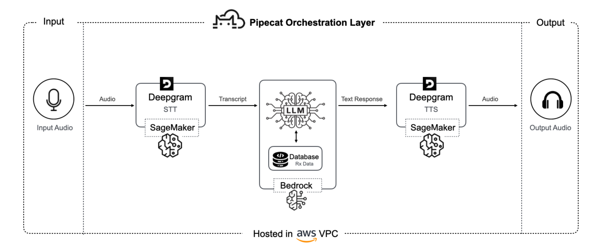

# RxConnect Voice Agent Demo

A production-ready voice AI agent demonstrating real-time conversational AI using **Deepgram** for speech processing on **AWS SageMaker**, **OpenAI** for LLM reasoning, and a custom **WebSocket-based orchestration layer** — all designed to keep speech data securely within an **AWS VPC**.



## Demo Video

To show what this unlocks in a real workflow, this demo showcases a **pharmacy voice agent** built on Deepgram and running on SageMaker.

In the demo, the agent handles an **end-to-end customer inquiry**:

1. Authenticating a caller with a Member ID
2. Pulling the correct order
3. Identifying the medication
4. Checking refill availability
5. Giving a precise pickup time

Each step is powered by **real-time streaming STT and agent logic**, so the interaction feels natural and responsive while retrieving accurate, structured data from backend systems.

[](https://www.youtube.com/watch?v=_Bm-nusSqHs)

---

## How the Demo Works

| Step | Component | Description |
|------|-----------|-------------|
| 1 | **Input Audio** | User speaks into microphone; browser streams 16-bit PCM via WebSocket |
| 2 | **Deepgram STT** | Audio streams to Deepgram Nova-3 via SageMaker Bidirectional Streaming API (or Deepgram Cloud as fallback) |
| 3 | **LLM (OpenAI)** | Transcript passed to GPT-4o-mini with pharmacy context and function calling |
| 4 | **Database** | LLM calls functions to query Rx database for orders, medications, refills |
| 5 | **Deepgram TTS** | Response synthesized to audio via Deepgram Aura-2 Cloud API |
| 6 | **Output Audio** | Audio streamed back over WebSocket and played in the browser |

### Architecture

```
┌─────────────────────────────────────────────────────────────────────────┐
│                         Browser (Next.js)                               │
│                                                                         │
│   ┌──────────┐    WebSocket (ws://localhost:8000/ws/voice)              │
│   │Microphone │─── audio stream (16-bit PCM, 16kHz) ──────────┐        │
│   └──────────┘                                                 │        │
│   ┌──────────┐                                                 │        │
│   │ Speaker   │◄── audio response (base64 PCM) ──────────┐    │        │
│   └──────────┘                                            │    │        │
│   ┌────────────────────────┐                              │    │        │
│   │ Conversation Panel     │◄── transcripts (JSON) ───┐   │    │        │
│   │ Database Panel         │                          │   │    │        │
│   └────────────────────────┘                          │   │    │        │
└───────────────────────────────────────────────────────┼───┼────┼────────┘
                                                        │   │    │
┌───────────────────────────────────────────────────────┼───┼────┼────────┐
│                   FastAPI Server (Python)              │   │    │        │
│                                                       │   │    │        │
│   ┌───────────────────────────────────────────────────┼───┼────┼─────┐  │
│   │                  VoiceAgent (per session)          │   │    │     │  │
│   │                                                   │   │    │     │  │
│   │  ┌──────────────┐   ┌──────────┐   ┌──────────┐  │   │    │     │  │
│   │  │     STT      │──►│   LLM    │──►│   TTS    │──┘   │    │     │  │
│   │  │  Deepgram    │   │  OpenAI  │   │ Deepgram │      │    │     │  │
│   │  │  Nova-3      │   │ GPT-4o-  │   │ Aura-2   │      │    │     │  │
│   │  │              │   │   mini   │   │ (Cloud)  │      │    │     │  │
│   │  └──────┬───────┘   └────┬─────┘   └──────────┘      │    │     │  │
│   │         │                │                            │    │     │  │
│   │         │                │  Function Calling          │    │     │  │
│   │         │                ▼                            │    │     │  │
│   │         │           ┌──────────┐                      │    │     │  │
│   │         │           │ Pharmacy │                      │    │     │  │
│   │         │           │ Database │                      │    │     │  │
│   │         │           │  (JSON)  │                      │    │     │  │
│   │         │           └──────────┘                      │    │     │  │
│   └─────────┼─────────────────────────────────────────────┼────┘     │  │
│             │                                             │          │  │
│             ▼  SageMaker mode                             │          │  │
│   ┌──────────────────────────┐                            │          │  │
│   │  AWS SageMaker Endpoint  │                            │          │  │
│   │                          │                            │          │  │
│   │  Deepgram Nova-3 model   │                            │          │  │
│   │  HTTP/2 bidirectional    │                            │          │  │
│   │  streaming               │                            │          │  │
│   └──────────────────────────┘                            │          │  │
│             ▲                                             │          │  │
│             └─────────────────────────────────────────────┘          │  │
│                          audio from client ──────────────────────────┘  │
└─────────────────────────────────────────────────────────────────────────┘
```

**Key points:**
- **STT** routes through AWS SageMaker (keeping audio within your VPC) or falls back to Deepgram Cloud
- **TTS** calls Deepgram Cloud directly (no audio input leaves the server — only synthesized text is sent)
- **LLM** calls OpenAI GPT-4o-mini with function calling for pharmacy database queries
- Each browser connection gets an **isolated VoiceAgent session** with its own STT stream, conversation history, and state

---

## What This Means for You

### Contact Centers
Real-time sentiment analysis and live agent coaching without infrastructure complexity.

### Conversational AI
More responsive applications that handle natural, flowing conversations users actually want to have.

### Analytics Teams
Process voice data as it comes in rather than waiting for batch jobs to complete.

### Compliance Teams
All the benefits of AWS's security model without worrying about data leaving your VPC for external speech processing.

---

## What You'll Learn

1. **Real-time Speech-to-Text** — Transcribe user speech using Deepgram Nova-3 via AWS SageMaker's bidirectional streaming API
2. **LLM Integration** — Process intent with OpenAI GPT-4o-mini and function calling
3. **Text-to-Speech** — Generate natural voice responses with Deepgram Aura-2
4. **Custom Voice Pipeline** — Orchestrate STT → LLM → TTS in a single WebSocket session with per-user isolation
5. **AWS VPC Deployment** — Keep STT processing secure within your AWS environment

---

## Project Structure

```
rxconnect-voice-agent/
├── server/                          # Python FastAPI backend
│   ├── main.py                      # VoiceAgent class + WebSocket endpoint
│   ├── requirements.txt             # Python dependencies
│   └── config/
│       ├── .env                     # API keys, AWS config, feature flags
│       ├── stt.py                   # STT settings (Nova-3, SageMaker toggle)
│       ├── tts.py                   # TTS settings (Aura-2, audio format)
│       └── llm.py                   # LLM config, system prompt, tool definitions
│
├── client/                          # Next.js frontend
│   ├── src/app/
│   │   ├── components/
│   │   │   ├── App.tsx              # Main application component
│   │   │   ├── ConversationPanel.tsx # Chat transcript display
│   │   │   ├── DatabasePanel.tsx    # Pharmacy data browser
│   │   │   └── useVoiceConnection.ts # WebSocket voice hook (mic, audio, messages)
│   │   ├── page.tsx
│   │   └── globals.css
│   ├── public/                      # Logos and static assets
│   └── package.json
│
├── data/
│   └── pharmacy-order-data.json     # Sample pharmacy database
│
└── README.md
```

---

## Quick Start

### Prerequisites

- Python 3.9+
- Node.js 18+
- Deepgram API Key ([deepgram.com](https://deepgram.com))
- OpenAI API Key ([platform.openai.com](https://platform.openai.com))
- AWS Account with:
  - SageMaker endpoint running the Deepgram Nova-3 model
  - Configured credentials (`~/.aws/credentials` or environment variables)

### 1. Clone the Repository

```bash
git clone https://github.com/deepgram/rxconnect-deepgram-pipecat-sagemaker-demo.git
cd rxconnect-deepgram-pipecat-sagemaker-demo
```

### 2. Set Up the Backend

```bash
cd server

# Create virtual environment
python -m venv venv
source venv/bin/activate  # Windows: venv\Scripts\activate

# Install dependencies
pip install -r requirements.txt
```

Edit `server/config/.env` with your credentials:

```env
# Deepgram (used for TTS and Cloud STT fallback)
DEEPGRAM_API_KEY=your_deepgram_key

# OpenAI
OPENAI_API_KEY=your_openai_key

# AWS SageMaker STT
USE_SAGEMAKER_STT=true          # false = use Deepgram Cloud STT instead
SAGEMAKER_ENDPOINT_NAME=your-deepgram-endpoint
AWS_REGION=us-east-2
AWS_PROFILE=your-aws-profile
```

Start the server:

```bash
python main.py
```

The server will start at `http://localhost:8000`

### 3. Set Up the Frontend

```bash
cd client
npm install
npm run dev
```

The frontend will be available at `http://localhost:3000`

### 4. Test the Voice Agent

1. Open `http://localhost:3000` in your browser
2. Click **"Connect"** to establish a WebSocket connection
3. The agent will greet you automatically
4. Speak naturally — the agent will respond!

---

## Sample Conversation

```
Agent: "Hi! You're speaking with our virtual pharmacy assistant.
        How may I assist you?"

You:   "I'd like to check on my prescription order"

Agent: "Of course! Could you please provide your member ID?"

You:   "M 1 0 0 1"

Agent: "Thank you. You have one order: O R D 0 0 1, currently processing."

You:   "What medication is in it?"

Agent: "Amoxicillin 500mg, 21 pills."

You:   "When will it be ready?"

Agent: "Your order should be ready for pickup on December 20th at 10 AM."

You:   "Do I have any refills?"

Agent: "You have 0 refills remaining for R X 1 0 0 1."

You:   "Thank you, goodbye"

Agent: "Thank you for calling. Goodbye."
```

---

## Key Technical Concepts

### Deepgram STT via SageMaker Bidirectional Streaming

The `deepgram-sagemaker` transport redirects Deepgram SDK streaming requests to a SageMaker endpoint over HTTP/2, keeping audio within your VPC:

```python
from deepgram_sagemaker import SageMakerTransportFactory
from deepgram.listen.v1.socket_client import AsyncV1SocketClient

factory = SageMakerTransportFactory(
    endpoint_name="your-deepgram-stt-endpoint",
    region="us-east-2",
)

query = "model=nova-3&encoding=linear16&sample_rate=16000&channels=1"
url = f"wss://api.deepgram.com/v1/listen?{query}"
transport = factory(url, {})

connection = AsyncV1SocketClient(websocket=transport)
await connection.start_listening()

# Stream audio in real-time
await connection.send_media(audio_chunk)
```

```
Standard Deepgram:   Client → WebSocket → api.deepgram.com → Nova-3
SageMaker mode:      Client → HTTP/2    → SageMaker Endpoint → Nova-3
```

**Why SageMaker?**

- Data stays within your AWS VPC
- No audio leaves your secure environment
- Same Deepgram quality and latency
- Enterprise compliance ready (HIPAA, SOC2)

### LLM with Function Calling

The LLM uses OpenAI's function calling to interact with the pharmacy database. The system prompt includes dynamic session context (verified member ID, current order ID) so the agent doesn't ask users to repeat information:

```python
tools = [
    {
        "type": "function",
        "function": {
            "name": "verify_member_id",
            "description": "Verify if a member ID exists in the system",
            "parameters": {
                "type": "object",
                "properties": {
                    "member_id": {"type": "string"}
                },
                "required": ["member_id"]
            }
        }
    },
    # list_member_orders, get_order_details,
    # get_order_timing, get_order_refills, lookup_order_status
]

response = await openai_client.chat.completions.create(
    model="gpt-4o-mini",
    messages=conversation,
    tools=tools,
    tool_choice="auto",
)
```

### Deepgram TTS (Cloud)

TTS calls Deepgram Cloud to synthesize the assistant's text response into audio, which is streamed back to the browser over the same WebSocket:

```python
audio_chunks = []
async for chunk in tts_client.speak.v1.audio.generate(
    text="Your order is ready for pickup!",
    model="aura-2-thalia-en",
    encoding="linear16",
    sample_rate=16000,
):
    audio_chunks.append(chunk)
```

**Aura Voice Options:**

| Voice | Style |
|-------|-------|
| aura-2-thalia-en | Warm, professional |
| aura-2-asteria-en | Clear, articulate |
| aura-2-luna-en | Friendly, conversational |
| aura-2-orion-en | Confident, authoritative |

### Multi-Session Isolation

The server supports multiple concurrent users with full isolation:

- Each WebSocket connection gets a unique **session ID** and its own `VoiceAgent` instance
- Each session has its own **STT stream**, **conversation history**, and **processing lock**
- A connection registry tracks active sessions and enforces a configurable concurrency limit
- All logs are prefixed with the session ID for easy debugging

```
[a3f1c82e] Connected (active sessions: 1)
[a3f1c82e] STT connected via SageMaker
[b7d2e41f] Connected (active sessions: 2)
[a3f1c82e] STT transcript: 'check my order' (is_processing=False)
[b7d2e41f] STT transcript: 'I need a refill' (is_processing=False)
```

---

## Pharmacy Agent Functions

| Function | Purpose | Example Response |
|----------|---------|-----------------|
| verify_member_id | Authenticate customer | `{"found": true, "member_id": "M1001"}` |
| list_member_orders | Get all orders | `{"orders": [{"order_id": "ORD001", "status": "processing"}]}` |
| get_order_details | Medication info | `{"prescriptions": [{"name": "Amoxicillin 500mg"}]}` |
| get_order_timing | Pickup/delivery time | `{"expected_pickup_time": "2025-12-20T10:00"}` |
| get_order_refills | Refill availability | `{"refills_remaining": 0}` |

---

## Configuration Reference

All runtime configuration lives in `server/config/`:

| File | Purpose |
|------|---------|
| `.env` | API keys, SageMaker endpoint, AWS region/profile, feature flags |
| `stt.py` | STT model (Nova-3), encoding, sample rate, SageMaker toggle |
| `tts.py` | TTS model (Aura-2), encoding, sample rate |
| `llm.py` | LLM model (GPT-4o-mini), system prompt, tool definitions, greeting |

Setting `USE_SAGEMAKER_STT=false` in `.env` switches STT to Deepgram Cloud — useful for local development without AWS access.

---

## Security & Compliance

Running Deepgram STT on SageMaker provides enterprise-grade security:

| Feature | Benefit |
|---------|---------|
| **VPC Isolation** | STT audio stays within your AWS environment |
| **No Data Egress** | Audio never leaves your network for transcription |
| **IAM Integration** | Fine-grained access control via SageMaker policies |
| **Audit Logging** | CloudTrail integration for all endpoint invocations |
| **HIPAA Eligible** | Healthcare compliance ready |
| **SOC2 Compliant** | Enterprise security standards |

---

## Technology Stack

| Layer | Technology | Role |
|-------|-----------|------|
| Speech Recognition | Deepgram Nova-3 on AWS SageMaker | Real-time speech transcription (VPC-isolated) |
| Transport | deepgram-sagemaker | Routes SDK streaming calls to SageMaker over HTTP/2 |
| Language Model | OpenAI GPT-4o-mini | Conversational reasoning and function calling |
| Speech Synthesis | Deepgram Aura-2 (Cloud) | Converts assistant text to natural speech |
| Backend | Python, FastAPI, WebSockets | VoiceAgent orchestration and session management |
| Frontend | Next.js, React, Tailwind CSS | Real-time browser interface with Web Audio API |
| Data Layer | JSON | Simulated pharmacy database |

---

## Troubleshooting

### SageMaker Connection Failed

```
Error: Could not connect to SageMaker endpoint
```

- Verify endpoint name and region in `server/config/.env`
- Check IAM permissions for `sagemaker:InvokeEndpoint`
- Ensure endpoint status is `InService`
- Try `USE_SAGEMAKER_STT=false` to confirm the rest of the pipeline works

### No Transcription Results

- Verify audio format: 16-bit PCM, 16kHz, mono
- Check SageMaker endpoint logs in CloudWatch
- Test with `USE_SAGEMAKER_STT=false` to use Deepgram Cloud

### No Audio Playback

- Grant microphone permissions in browser
- Check browser console for Web Audio API errors
- Ensure volume is not muted

### TTS Errors (401 Unauthorized)

- Verify `DEEPGRAM_API_KEY` is set correctly in `server/config/.env`
- Confirm the key is active at [console.deepgram.com](https://console.deepgram.com)

---

## License

MIT License — Use this for learning and building your own voice agents!

## Resources

- [Deepgram Documentation](https://developers.deepgram.com)
- [Deepgram on AWS Marketplace](https://aws.amazon.com/marketplace/seller-profile?id=seller-k3ihfqamkbqps)
- [Amazon SageMaker](https://aws.amazon.com/sagemaker/)
- [Pipecat Framework](https://github.com/pipecat-ai/pipecat)
- [OpenAI API](https://platform.openai.com/docs)

---

**Built with [Deepgram](https://deepgram.com)** — deepgram.com
